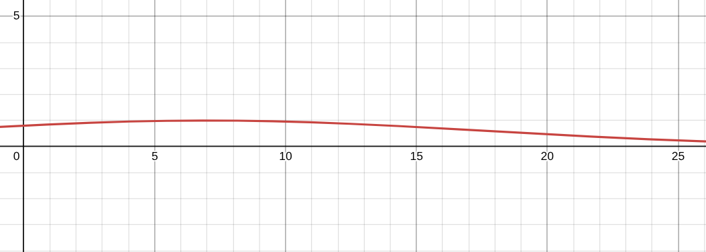

# Widget
- The application offers four different types of widgets:
- There are:
  - Achievement Widget: Displays user achievements
  - Forum Activity Widget: Shows user's activity within the forum
  - Open Question Widget: Lists open or unanswered questions that may need attention or input.
  - 
## Achievement Widget
- TBD

## Activity Widget
- Displays the latest forum activities, including:
  - Creating new threads
  - Posting replies to existing threads
- The widget uses a simple algorithm that returns the most recent activities based on their creation date.

## Open Question Widget
- Ranks question threads based on their age and popularity (upvotes)
- Formular: priorityScore = α × ageScore + β × upvoteScore
  - Age Score (Gaussian distribution): Favors questions around 7 days old (peakAge), while significantly penalizing very new or very old ones based on the rate defined by spread (15).
    -  E.g.: 7 days -> ageScore = 1
       E.g.: 0 days  -> ageScore = 0.804
       E.g.: 22 days -> ageScore = 0.367
       

  - Upvote Score: Calculated relative to the post with the highest upvotes in the forum. Posts with upvote counts approaching this maximum are ranked higher, while posts with negative net upvotes are penalized more heavily
    - Positive votes scaled linearly between 0.1 and 1.0
    - Negative votes penalized quadratically but never drop below 0.01
      - E.g.: upvotes = +10 maxUpvotes = 20 -> upvoteScore = 0.55
      - E.g.: upvotes = +1 maxUpvotes = 10 -> upvoteScore = 0.19
      - E.g.: upvotes = 0 maxUpvotes = 10 -> upvoteScore = 0.1
      - E.g.: upvotes = -1 maxUpvotes = 10 -> upvoteScore = 0.0909 
  - Weighting Factors: Prioritize the Age Score slightly more than the Upvote Score, reflecting a stronger emphasis on recency over popularity.  
    - α = 0.6
    - β = 0.4

