# Setup Guide 

After the deployment with terraform we have to configure keycloak and Minio for MEITREX. This guide illustrates steps 6 and 7 in the setup guide to assist users in setting up meitrex. 

## Step 6 Setup keycloak realm

We have to setup the keycloak realm. We simply navigate to the creator page and copy the contents of the realm file provided in this repository. 

1. Open the keycloak endpoint. For our deployment the endpoint is accessible under `dev.meitrex.de/keycloak` 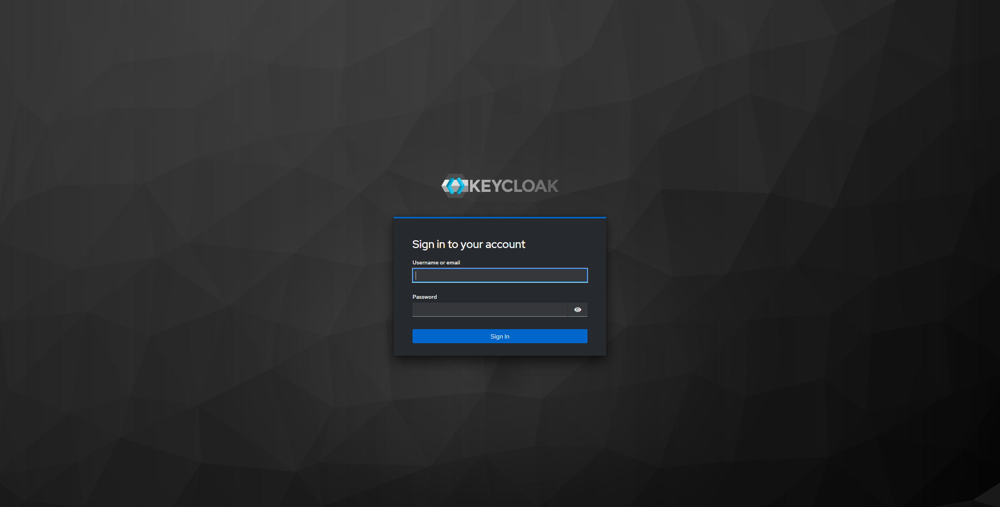
2. Login into Keycloak with the default user credentials set in the variables file. 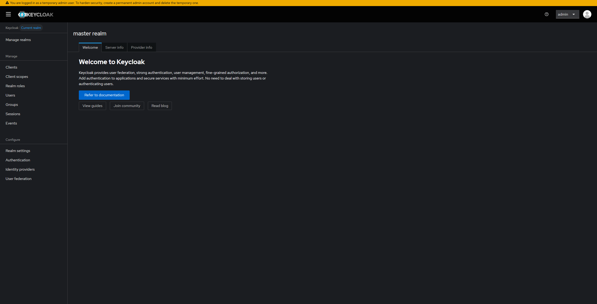
3. Click Manage realms page 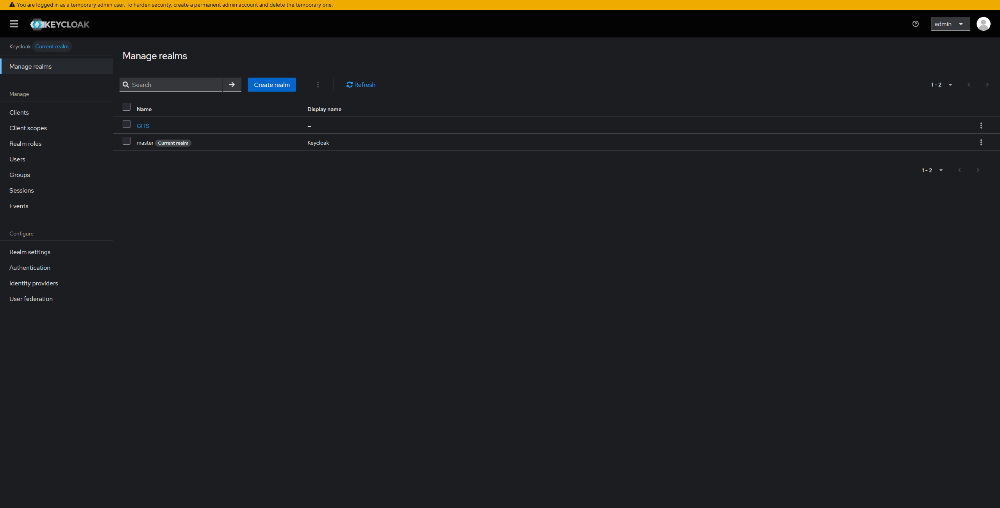
4. Click Create realm button 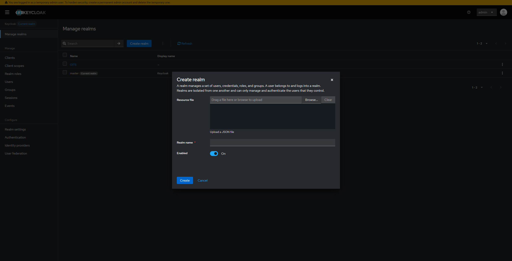
5. Import realm provided in this repository. Copy contents of GITS realm file into the form 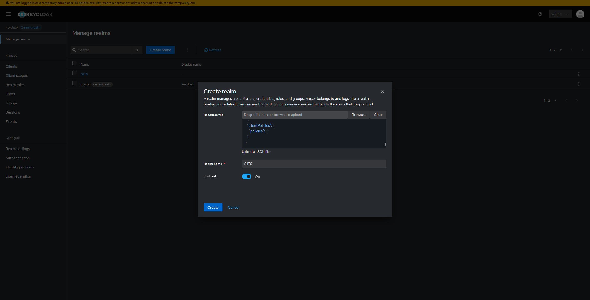
6. Press Create

## Step 6 Setup webhook for AI Service

We need the webhook because if we upload a file MINIO will use the webhook to notify the DocProcAI Service to start processing the new content. The webhook is already defined and configured in the helm chart. Currently we cant automatically ad webhook to the buckets so we have to do it manually. 

1. Open Minio endpoint. For our deployment the endpoint is accessible under `minio-dashboard.meitrex.de` 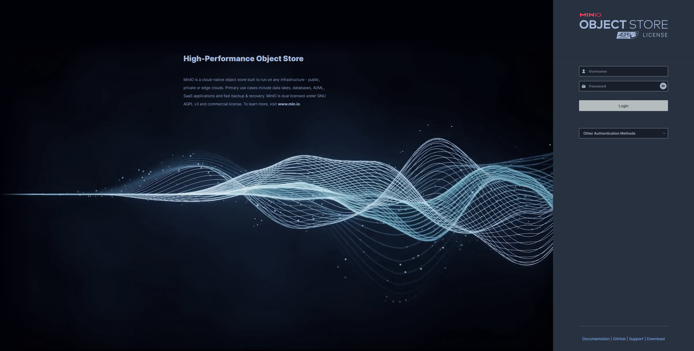
2. Login to MINIO with the default user credentials. 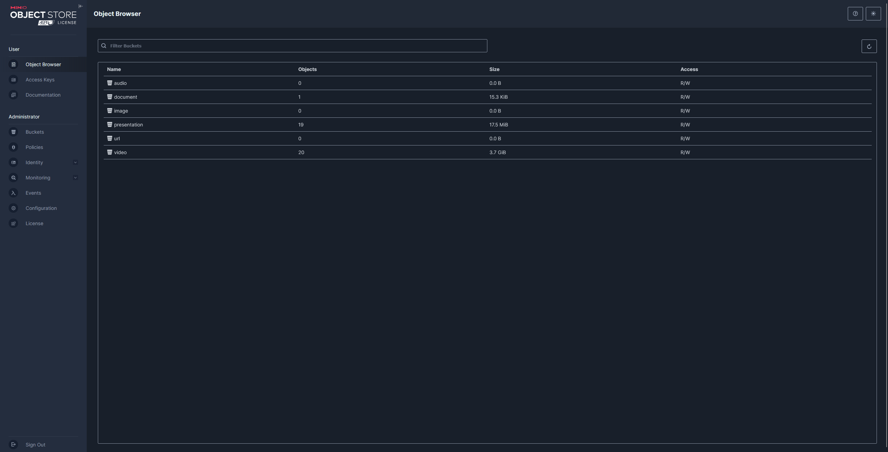
3. Select Buckets 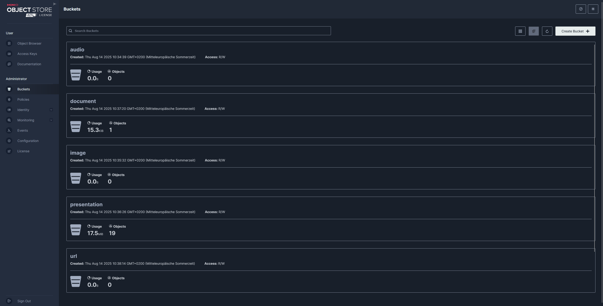
4. Select one bucket e.g. audio 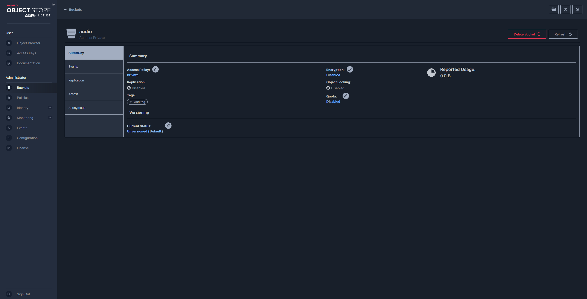
5. Select events 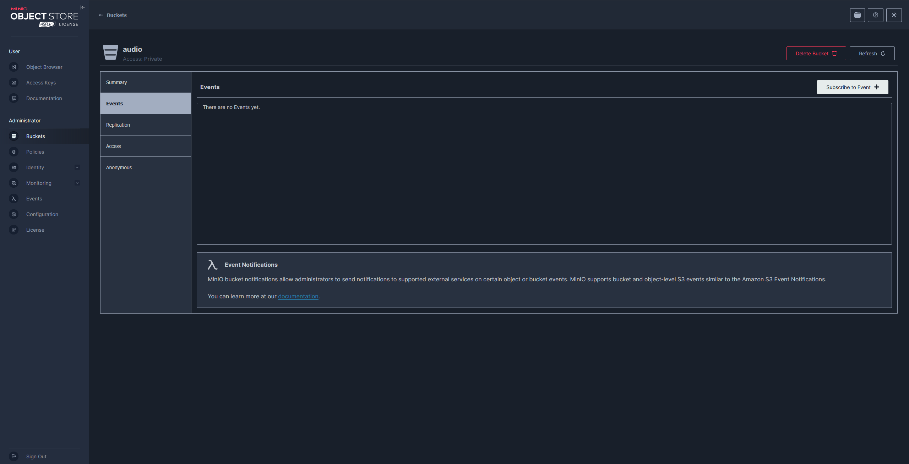
6. Press subscribe to event  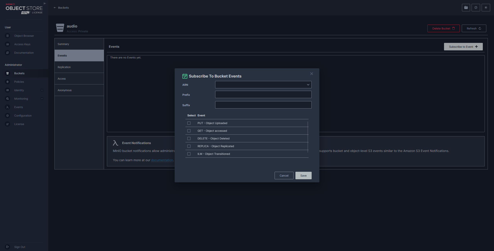
7. For APN select `arn:minio:sqs::onObjectCreated:webhook` leave Prefix and Suffix empty Select Event PUT 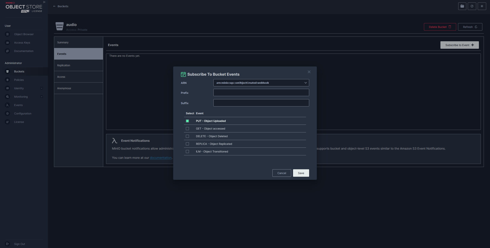
8. Press Save

Repeat this for the buckets `document`, `presentation` and `video`.
