# Introduction

This is a research project that aims to integrate automated UML assessment into Meitrex. The system will incorporate Hylimo to enable the creation and submission of UML assignments. Student solutions will then be automatically evaluated based on reference solutions provided by tutors.

**What is HyLiMo?** [Hylimo](https://hylimo.github.io/docs/docs.html) is a hybrid diagramming tool that enables users to create and edit diagrams, such as UML diagrams, by using a combination of textual code (a domain-specific language) and a graphical editor. Changes made to either the code or the visual representation are automatically synchronised, ensuring both views always remain consistent.
This paper consists of:

- Requirements
- System Design and Architecture
- Evaluation
- Functionalities
- Future Improvements

# Requirements

Based on the objectives of this research project, the following section defines the **high-level requirements** for integrating automated UML assessment into Meitrex using HyLiMo.

- Creating a UML assessment (Task and Solution)
- Working on a UML assessment
- Saving a UML assessment solution
- Submitting a UML assessment
- Redoing a UML assessment (if possible)
- Evaluate a UML diagram
- View Submitted UML Assessment
- Lecturer Views and Manages Student Submissions

With the help of the high-level requirements **use cases** were created. For example 'Create UML Assessment':

| Field | Description |
|---|---|
| Use Case ID | UC-01 |
| Name | Create UML Assessment |
| Actors | Instructor (Primary), System (Secondary) |
| Description | The Instructor defines a new UML assessment, including the task and the correct solution, for Students to complete. |
| Preconditions | - The Instructor is authenticated and has assessment-creation privileges.<br>- A course exists for this assessment to be created inside of. |
| Postconditions | - The new UML assessment is created and saved in the System. (FR-AC-05)<br>- The assessment is available for Students (or becomes available at a set date). |
| Main Success Flow | 1. Instructor navigates to the “Create UML Assessment” page.<br>2. Instructor enters the assessment title and task description (FR-AC-02).<br>3. Instructor uses the embedded HyLiMo editor to create the model solution (FR-AC-03).<br>4. Instructor sets the assessment parameters (FR-AC-04).<br>5. Instructor clicks “Create”.<br>6. The system validates the inputs, saves the assessment and model solution, and makes it available to Students. |
| Extensions | **5a. Instructor clicks “Save as Draft”**:<br>- The system saves the assessment in an unpublished state, visible only to the Instructor. |

The **functional requirements** were then derived from the use cases for example 'Assessment Creation':

**FR-AC: Assessment Creation**

- **FR-AC-01:** The system shall provide an interface for an instructor to create a new UML assessment.  
- **FR-AC-02:** The system shall allow the instructor to input a task description.  
- **FR-AC-03:** The system shall provide a HyLiMo editor for the instructor to create an official model solution.  
- **FR-AC-04:** The system shall allow the instructor to configure assessment parameters:
  - Skill type  
  - Solution visibility with threshold  
- **FR-AC-05:** The system shall save assessment parameters and the created solution diagram.

*Note: For all use cases and functional requirements check out: [Use cases and functional requirements](https://docs.google.com/document/d/1zKl2Vpk7k4WUOQumee5xeIibMjcerCa-Pp7XphvoagM/edit?tab=t.0
).*

# System Design and Architecture

## Domain Model
The diagram shows the domain model for the UML assignment. An UmlExercise is the task created by the tutor. For each exercise, a student has a UmlStudentSubmission, which contains all their attempts. Each submission can include multiple solutions (UmlStudentSolution). Every solution contains a UML diagram and can receive feedback with points and comments.

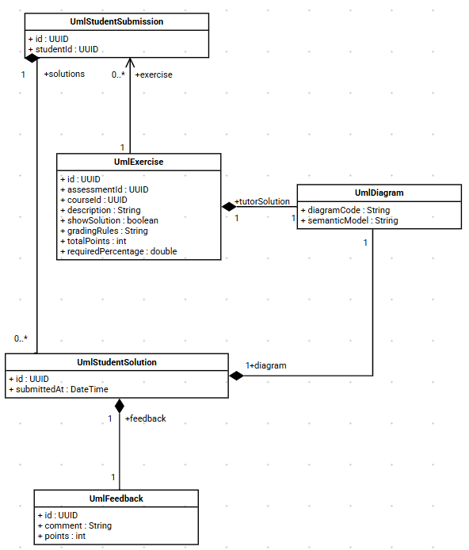

## HyLiMo Integration

One of the main tasks was the integration of HyLiMo into MEITREX. With the support of the HyLiMo author and the analysis of available resources (e.g., a bachelor’s thesis), all relevant components were identified before implementation. The needed HyLiMo code was originally built using Vite. This code served as the basis for the migration into our Next.js (React) project. As part of this process, the application had to be adapted and converted from the Vite setup to the Next.js architecture.

## Automated UML Assessment

The second major task was the automatic evaluation of UML diagrams based on the tutor’s solution.

Evaluation starts when a student submits a UML solution in the frontend. The frontend sends a GraphQL mutation to store the submission with submit: true. The backend persists the solution, sets its submission timestamp, creates an evaluation job with status ENQUEUED, and returns immediately so the user does not wait for LLM processing.

A background worker then handles queued jobs asynchronously. The queue service periodically selects the oldest ENQUEUED job, switches it to PROCESSING, and executes evaluation in a separate async step. The evaluation service performs two consecutive LLM calls: first, semantic analysis comparing the student’s semantic model with the tutor reference model; second, grading based on the analysis result, grading rules, and scoring thresholds. The generated feedback text and points are stored as UmlFeedback for the submitted solution.

After persistence, the job state is finalized as DONE; if an exception occurs, it is finalized as FAILED and the error message is recorded. In both success and failure paths, a notification event is published via Dapr so users can be informed proactively. While processing runs in the background, the frontend can repeatedly query evaluationStatus over GraphQL and display the current state (ENQUEUED, PROCESSING, DONE, FAILED) until final feedback becomes available.

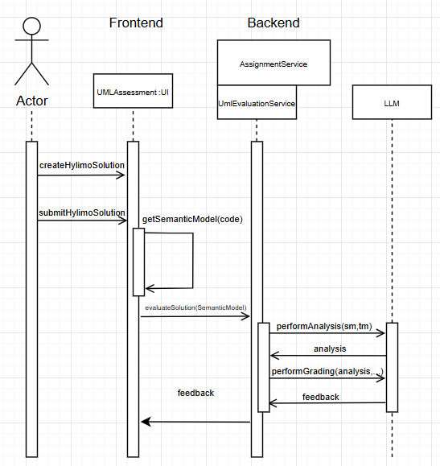

### Prompt Engineering

<details>
  <summary>Filename: 'uml_analysis'</summary>

```txt
### ROLE
You are an Experienced Software Engineering Professor and UML Evaluator.
Your task is to compare the **Reference Solution** against the **Student Submission**, but you must prioritize *theoretical correctness* and *semantic meaning* over strict syntactic matching.

### EQUIVALENCE RULES (CRITICAL - DO NOT PENALIZE FOR THESE)
1. **Data Types:** Treat semantically similar types as identical (e.g., `int` == `Integer`, `String` == `string`, `Long` == `long`, `boolean` == `Boolean`).
2. **Association Labels:** Focus on the *meaning* of the relationship, not the exact string. (e.g., "owns", "has", "contains", and "is part of" are effectively equivalent if the multiplicity and direction are correct).
3. **Architectural Variations:** Students may solve domain problems slightly differently.
   - Example 1: Using an `Enum` for a property vs. a dedicated Class with constraints.
   - Example 2: Using an `abstract class` instead of an `interface`.
   - If the student's alternative logically fulfills the same domain requirement as the reference, accept it as CORRECT.

### DATA TO ANALYZE
- **Reference Solution:**
---
{{tutorModel}}
---
- **Student Submission:**
---
{{studentModel}}
---

### CATEGORIZATION STRICTNESS
- **correctElements:** List all correctly implemented details. If a student used an acceptable equivalent (e.g., `int` instead of `Integer`), list it here as correct.
- **missingElements:** List items that are COMPLETELY absent and have no logical equivalent in the student's code.
- **semanticErrors:** List items that are actively WRONG (e.g., a composition used where an inheritance was clearly required, or fundamentally backward multiplicities).

### CRITICAL OUTPUT RULES
- Do NOT deduct points or list errors for layout attributes (e.g., `pos`, `vdist`, `layout`).
- Output ONLY valid JSON.
- Every element analyzed MUST be present in exactly one of the three arrays.

**Output Format (JSON):**
{
"correctElements": ["List specific correct elements and accepted equivalents."],
"semanticErrors": ["List actively INCORRECT structural logic."],
"missingElements": ["List completely ABSENT elements."],
"isSemanticallyValid": <boolean>,
"analysisSummary": "A concise summary derived strictly from the lists above."
}
```

</details>

The 'uml_analysis' evaluates student UML diagrams against a reference solution by focusing on semantic correctness. It identifies correct elements, missing parts, and real structural errors, and outputs a structured JSON analysis.

<details>
  <summary>Filename: 'uml_grading'</summary>

```txt
### ROLE
You are a supportive Software Architecture Tutor. Your goal is to transform technical analysis into constructive HTML feedback and calculate a final grade based strictly on the provided rubric.

### GRADING LOGIC (FOLLOW STRICTLY)
- **Total Possible:** {{maxPoints}} points.
- **Passing Threshold:** {{passingThreshold}} points.
- **Reference Rubric:** {{gradingRules}}

**Calculation Hierarchy:**
1. Start at {{maxPoints}} points.
2. Look at the items in `semanticErrors` and `missingElements`.
3. For EACH error, find the corresponding penalty in the **Reference Rubric**.
4. Subtract the penalty from the current score. (e.g., If the rubric says "-0.25P per missing class" and there are 2 missing classes, subtract 0.5P).
5. DO NOT deduct points for anything not explicitly listed in the errors arrays.
6. If the final score drops below 0, set it to 0.

### PEDAGOGICAL GUIDELINES
1. **The "Sandwich" Method:** Start with specific praise (correctElements), address gaps (semanticErrors/missingElements), and end with motivation.
2. **Spoiler Policy:** The 'Show Solution' flag is: {{showSolution}}
   - **If FALSE:** Provide Socratic hints (e.g., "Check the relationship multiplicity."). DO NOT give the exact answer.
   - **If TRUE:** You may explicitly state the correct answer.
3. **Mandatory Sign-off:** You MUST conclude the HTML string exactly with: `<br><br>Best Regards,<br>Your AI Tutor`

### DATA FOR REPORT
- **Valid Graph:** {{isValid}}
- **Things Done Well:** {{correctElements}}
- **Logic Errors:** {{semanticErrors}}
- **Missing Items:** {{missingElements}}

### TECHNICAL CONSTRAINTS
- **Output Format:** STRICT JSON containing an HTML string and an integer/float.
- **Allowed HTML:** `<b>`, `<i>`, `<p>`, `<br>`, `<ul>`, `<li>`. No Markdown, no CSS.
- **No Score in Text:** DO NOT state the points inside the HTML feedback string.

### OUTPUT SCHEMA
{
"feedback": "<p>Your HTML feedback here...</p><br><br>Best Regards,<br>Your AI Tutor",
"points": <calculated_number>
}
```

</details>

The 'uml_grading' uses the analysis output to generate constructive HTML feedback and calculate a final score. It applies strict grading rules, provides pedagogical feedback, and ensures a structured JSON result with points and feedback.

## Evaluation

### Goals

The goal of this evaluation is to assess how accurately the automated UML assessment system can replicate human grading. In particular, we investigate whether the system can produce scores comparable to lecturer evaluations and how different large language models influence the assessment quality.

### Setup

The evaluation uses real-world data consisting of 20 previous student UML diagrams. These diagrams were converted from their original formats into HyLiMo DSL code to be compatible with the new system. A "Gold Standard" was established using reference solutions from tutors that originally received full marks.

### Methodology

The evaluation was conducted in two phases: an initial comparison of various Large Language Model (LLM) configurations to determine an optimal baseline, followed by an investigation into the effectiveness of different prompt engineering strategies.
For better comparison each LLM configuration was run five times for each UML diagram to create an anverage grade for this configuration and diagram.
This enabled us to make a fairer comparison between configurations since hallucinations would be easier to find.

#### Performance of LLM Configurations

A total of six configurations were evaluated using a dataset of historical student UML submissions. One of those configurations entailed the usage of the (at that point in time) new `gemma4` model. Installation of that model went corretcly, but the server was not able to load that model into memory, thus rendering the evaluation on that configuration impossible.
Thus only five different configurations could be evaluated. To ensure the reliability of the statistics, data points where the system returned zero points—caused by documented backend service interruptions such as DGX server or Ollama service crashes—were excluded from the final analysis.

#### Evaluation of Prompting Strategies

Following the model comparison, three prompt variations were tested specifically using the model that achieved the best variance in the baseline test to assess the impact of task context on grading accuracy.
Here we compared three different prompt strategies against each other for the analysis part of the evaluation:

1. Standard: The same prompt as in the previous baseline test. This compares the semantic model of student against the model of the tutor solution
2. Task_added: In this prompt the task description was added to give further information about potentially correct deviations from the tutor solution
3. Pure_Task: Due to the LLM comparing too strictly against the tutor solution this prompt only contains the student solution and the task description to make logical decisions about the analysis of the students solution against the information gioven in the task

<details>

  <summary>Pure Task Prompt: 'uml_analysis_pure_task'</summary>

  ```txt
  ### ROLE
  You are an Expert Requirements Engineer and Software Architecture Evaluator.
  Your task is to evaluate a student's UML class diagram based STRICTLY and ONLY on the original assignment task. You do not have a reference solution. You must deduce the correctness entirely from domain logic and the provided requirements.

  ### DATA TO ANALYZE
  - **Original Assignment Task:**
  ---
  {{taskDescription}}
  ---
  - **Student Submission:**
  ---
  {{studentModel}}
  ---

  ### EVALUATION STRATEGY
  1. Read the **Assignment Task** and extract every explicit requirement (entities, attributes, and relationships).
  2. Analyze the **Student Submission**. Check if every requirement from the task is fulfilled.
  3. Because there is no reference solution, you must be tolerant of different architectural choices. If a student uses an Enum, a Class, or an Interface in a way that logically solves the domain problem described in the task, mark it as CORRECT.
  4. Only penalize elements if they directly contradict the task description or violate standard UML logic.

  ### CATEGORIZATION STRICTNESS
  - **correctElements:** List elements that successfully fulfill a requirement from the Assignment Task.
  - **missingElements:** List elements explicitly requested by the Assignment Task that the student failed to include.
  - **semanticErrors:** List elements that violate UML logic or explicitly contradict the Assignment Task.

  ### CRITICAL OUTPUT RULES
  - Ignore visual layout coordinates (pos, vdist, layout, etc.).
  - Output ONLY valid JSON matching the exact schema below.

  **Output Format (JSON):**
  {
  "correctElements": ["Elements fulfilling the task requirements."],
  "semanticErrors": ["Logical violations or contradictions of the task."],
  "missingElements": ["Elements required by the task that are missing."],
  "isSemanticallyValid": <boolean>,
  "analysisSummary": "A concise summary of how well the student met the task requirements based ONLY on the text prompt."
  }
  ```

</details>

<details>

  <summary>Task added Prompt: 'uml_analysis_task_added'</summary>

  ```txt
  ### ROLE
  You are a Requirements-Driven Software Architecture Evaluator.
  You are evaluating a student's UML class diagram based *strictly on the original assignment task*. A Tutor Reference Solution is provided, but it is only *one possible valid solution*, not the absolute truth.

  ### DATA TO ANALYZE
  - **Original Assignment Task:**
  ---
  {{taskDescription}}
  ---
  - **Tutor Reference Solution (Use as a complexity hint only):**
  ---
  {{tutorModel}}
  ---
  - **Student Submission:**
  ---
  {{studentModel}}
  ---

  ### EVALUATION STRATEGY
  1. Read the **Assignment Task** to understand the required entities, attributes, and relationships.
  2. Analyze the **Student Submission**. Does it fulfill the core requirements of the task?
  3. If the student diverges from the Tutor Reference but still logically satisfies the Assignment Task (e.g., using a List of Enum values instead of a dedicated Rating class), mark it as **CORRECT**.
  4. Do NOT penalize for minor syntax variations (`int` vs `Integer`) or slightly different but logical association names.

  ### CATEGORIZATION STRICTNESS
  - **correctElements:** List elements that successfully fulfill a requirement from the Assignment Task.
  - **missingElements:** List elements explicitly requested by the Assignment Task that the student failed to include.
  - **semanticErrors:** List elements that violate UML logic or explicitly contradict the Assignment Task.

  ### CRITICAL OUTPUT RULES
  - Ignore visual layout coordinates.
  - Output ONLY valid JSON matching the exact schema below.

  **Output Format (JSON):**
  {
  "correctElements": ["Elements fulfilling the task requirements."],
  "semanticErrors": ["Logical violations or contradictions of the task."],
  "missingElements": ["Elements required by the task that are missing."],
  "isSemanticallyValid": <boolean>,
  "analysisSummary": "A concise summary of how well the student met the task requirements."
  }
  ```

</details>

### Metrics

The evaluation is based on the following metrics:

- Human-AI Agreement: The correlation between the AI-generated points and the original lecturer’s grades.
- LLM Benchmarking: Comparative performance based on speed and reasoning quality.
- Variance of LLMs: Average variance between runs of a single submission to see if the LLM feedback will be kept in the same ballpark.
...

### Result

#### Performance of LLM Configurations

| Configuration | Avg Abs. Deviation | Avg Bias (LLM vs Human) | Avg Variance | Total Time (s) |
| :--- | :--- | :--- | :--- | :--- |
| 'Speed_Demon_Llama3.1 (`llama3.1:8b`)' | 1.710 | -1.638 | 0.4833 | **16.2** |
| 'Baseline_Mixtral (`mixtral:8x22b`)' | 1.800 | -1.778 | 0.2584 | 123.3 |
| 'Gold_Standard_Llama3.3 (`llama3.3:70b`)' | 2.600 | -2.600 | **0.1052** | 285.2 |
| 'Smart_Hybrid_Qwen_Llama (`qwen2.5-coder:32b` / `llama3.3:70b`)' | 2.650 | -2.650 | 0.1161 | 230.2 |
| 'Pure_Qwen (`qwen2.5-coder:32b`)' | 2.655 | -2.655 | 0.1929 | 161.9 |

**Key Findings:**

- **Grading Strictness**: All tested models exhibited a negative bias, indicating that the automated system generally grades more strictly than human lecturers.
- **Consistency**: The 'Gold_Standard_Llama3.3' provided the most consistent results, demonstrated by the lowest average variance of 0.1052.
- **Efficiency**: The 'Speed_Demon_Llama3.1' outperformed all other configurations in speed, completing the evaluation in an average of 16.2 seconds, approximately 17 times faster than the Gold Standard.

#### Prompting Strategies

| Configuration | Avg Abs. Deviation | Avg Bias (LLM vs Human) | Avg Variance | Total Time (s) |
| :--- | :--- | :--- | :--- | :--- |
| 'Standard_Llama3.3' | **1.249** | -1.139 | 0.4602 | 171.1 |
| 'Task_added_Llama3.3' | 1.448 | -1.294 | 0.7742 | 0.0* |
| 'Llama3.3_Pure_Task' | 1.477 | -1.304 | **0.3719** | 171.4 |

*\*Note: Total time for 'Task_added' was recorded as 0.0 in the evaluation logs due to some problems in with the DGX. These stats could not be gathered.*

**Key Findings:**

- **Reference Solution Importance**: The 'Standard_Llama3.3' configuration, which compares the tutor reference directly to the student submission, yielded the lowest deviation from human grades (1.249).
- **Context Noise**: Adding the task description ('Task_added') increased both the absolute deviation (1.448) and the variance (0.7742), suggesting that additional context may introduce noise into the structural comparison logic.
- **Pure Task Logic**: The 'Llama3.3_Pure_Task' variant, which graded submissions without a reference solution, showed the highest consistency (lowest variance at 0.3719) but lower overall accuracy compared to the standard approach.

### Conclusion

The results indicate that automated UML assessment effectively replicates human grading patterns. For real-time feedback within the HyLiMo editor, high-speed models such as Llama 3.1 are optimal. For final summative assessment, `llama3.3:70b` combined with the 'Standard' prompt strategy provides the most reliable results.

*UPDATE:* Due to a change from ollama to Llama swap different models have been downloaded unto the DGx.
In the current version (May 18th 2026) the model `qwen3-coder-80B-A10B` is used for both analysis and grading.
In the production setting it can always be overwritten by the `OLLAMA_MODEL` environmental variable.

*IMPORTANT:* Sicne the LLM calls use Llama on the DGX now the requests need an API Key to work.
Locally you can create a `.env` file similar to the `.env.example`, while in production you need to add the API Key as the `OLLAMA_API_KEY` environmental variable.
To get the API Key you need to ask your supervisor (most likely Niklas).

## Functionalities

### User Guide for Lecturer

#### Introduction

Tutors can create and provide model solutions for UML assignments within Hylimo. Student submissions are then automatically evaluated against the tutor solution.
For more information about HyLiMo check out: <https://hylimo.github.io/docs/docs.html>

#### Create UML assignment

UML assignments can be created in the same way as other assignments

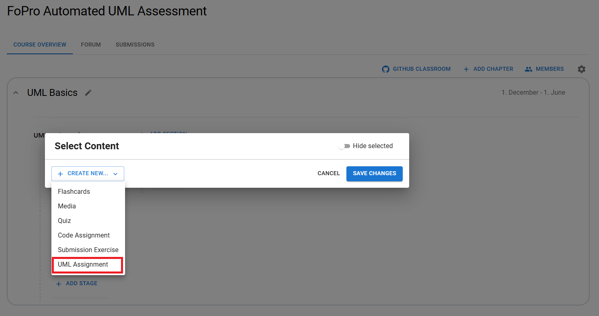

When selecting 'UML Assignment', a pop-up window opens where the assignment can be created.

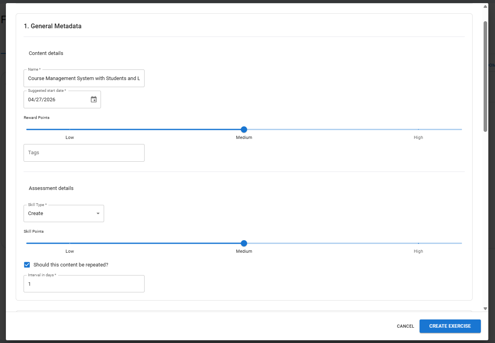

In the pop-up window, similar to other assignments, the metadata can be filled in. Below that, the UML-specific fields are available.

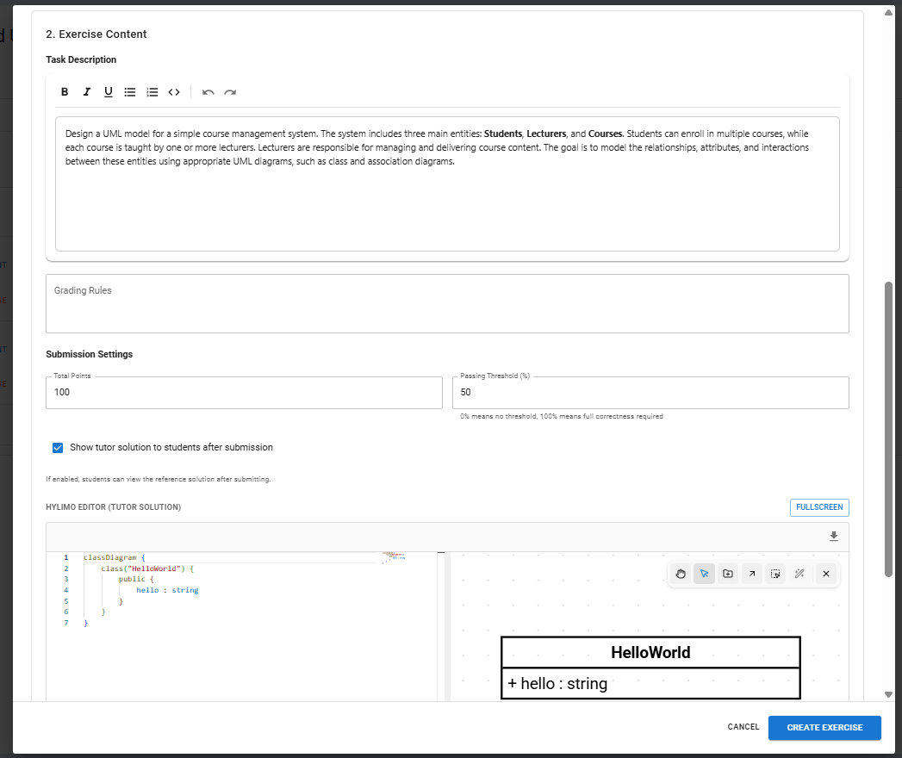

The UML Assignment creator includes a rich text editor where the task description can be written. In addition, grading criteria can be defined to support the LLM-based evaluation of the diagram.
In the settings, you can set the total number of points and the passing threshold, as well as choose whether the model solution should be displayed. The tutor can also provide a HyLiMo reference solution, which is then used as the basis for the LLM’s evaluation.

#### UML Assignment Overview

When a lecturer selects the assignment, they will see an overview of the entire assignment with all information related to the created task. They can then edit the assignment, which opens a pop-up window where changes can be made.

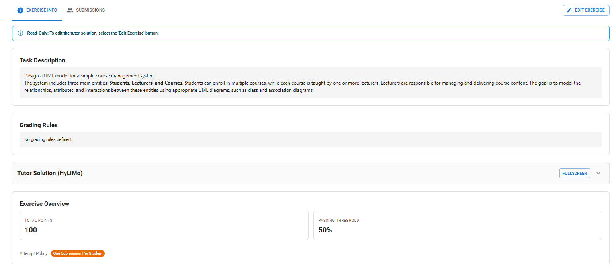

They can also navigate to the submissions tab to get an overview of the solutions submitted by students.

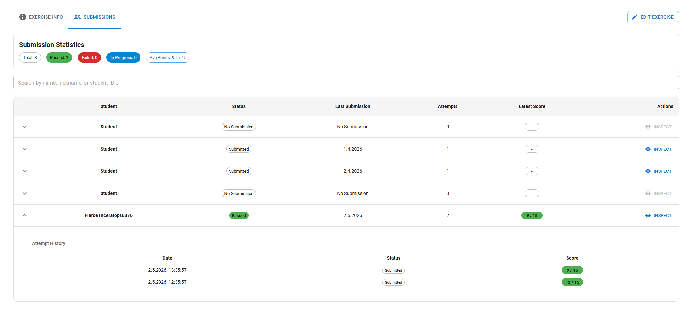

Lecturer can also inspect the student solution to see their evaluation and solution.

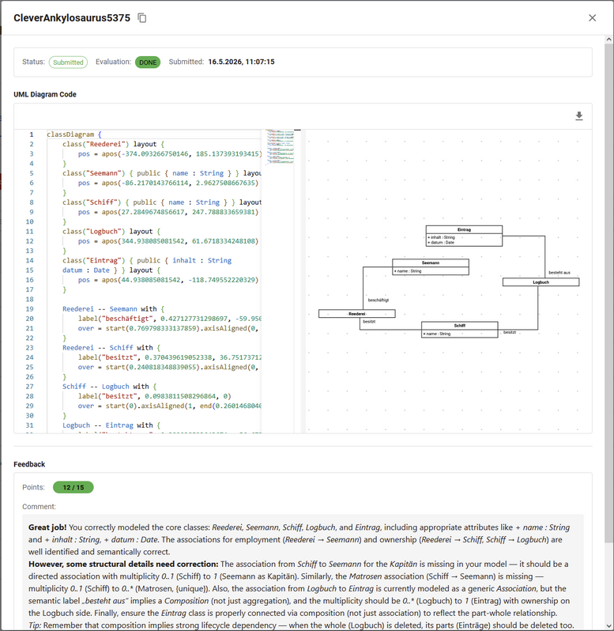

### User Guide for Student

#### Introduction

For UML assignments, students complete tasks within Hylimo by creating their own UML models. Their submissions are automatically evaluated, allowing them to receive feedback.
For more information about HyLiMo check out: <https://hylimo.github.io/docs/docs.html>

#### Work on UML Assessment

Students can open the UML assignment just like any other assignment. Once opened, they can work on it using the built-in editor.

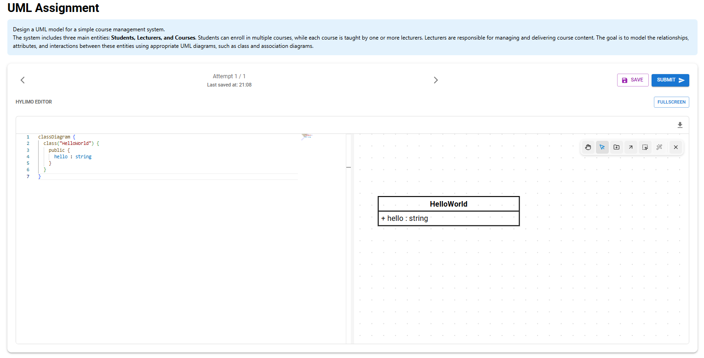

At the top, you can see the task description. Below that, there are options to move between attempts, save the work, or submit the solution. After submitting, a new attempt can be started, either empty or based on a previous one. The main part of the screen is the Hylimo editor, where students work on their solution. The editor can also be opened in full-screen mode for easier editing.

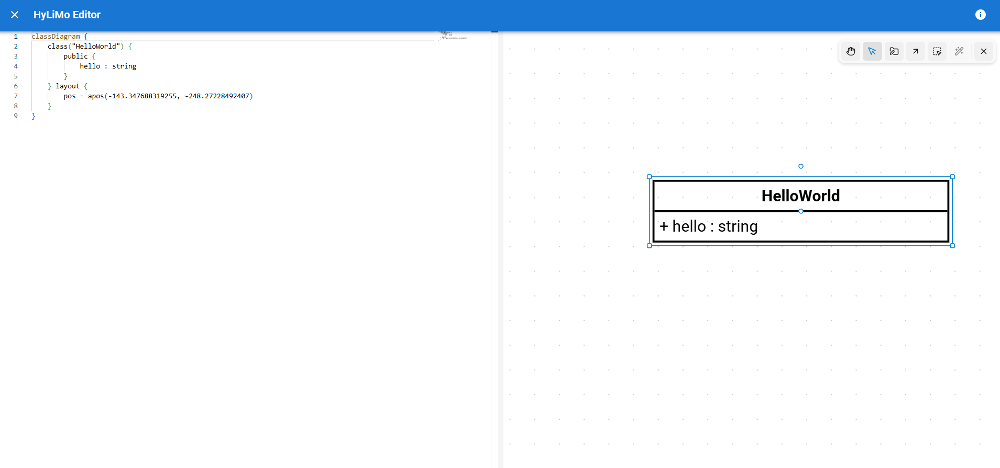

#### UML Evaluation

After submission, the solution is evaluated by the system. The system provides feedback. Evaluated submissions cannot be edited.

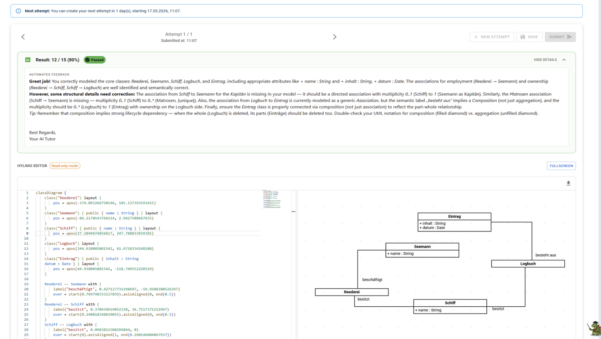

## Future Improvements

Although the current integration successfully demonstrates the potential of automated UML assessment, there are several areas that could be improved to enhance the system's accuracy and user experience.

### Aligning with Human Grading

Our evaluation revealed that the automated system currently grades slightly more strictly than human tutors. A key future objective is to adjust the grading logic so that the system evaluates submissions in a more natural way, reflecting the judgement and natural leniency of a human instructor more closely.

### Step-by-Step Evaluation

Our tests showed that providing the system with too much context at once, such as combining the reference solution and the complete task description, can introduce noise and reduce the accuracy of the assessment. To improve the quality of feedback overall, future iterations can split the evaluation process into distinct, manageable steps. This will allow the AI to process information more effectively and avoid becoming overwhelmed.

### Learning from Past Submissions

Although the current implementation uses general-purpose AI models, there is significant potential in tailoring the system to this specific domain. Training the AI on historical UML submissions and prior tutor feedback could make the system more consistent and better able to assess student solutions.

### Visual Feedback in the Editor

Currently, students primarily receive their evaluation in text format. It would be a valuable enhancement to integrate this feedback directly into the diagram's visual representation. By automatically highlighting incorrect or missing elements within the graphical HyLiMo editor, students could identify mistakes and structural issues much more easily.
