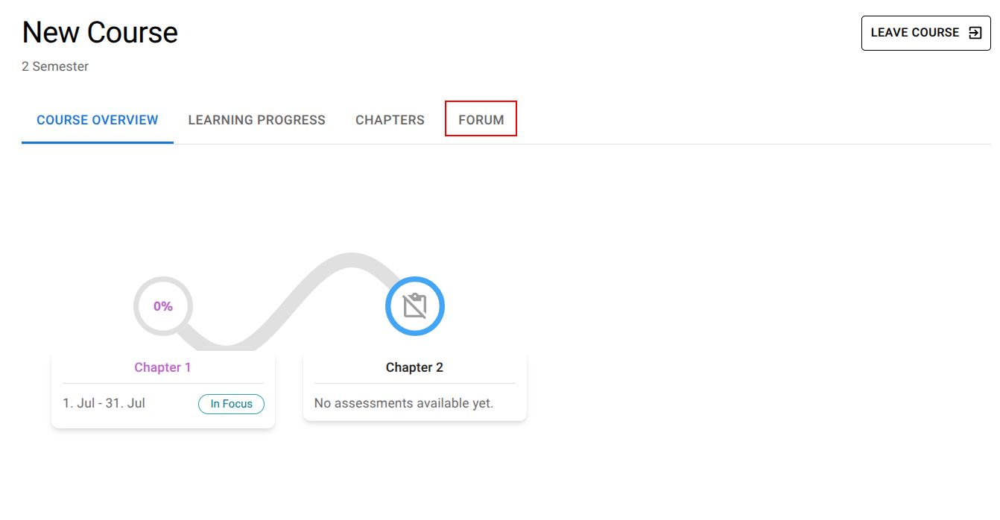
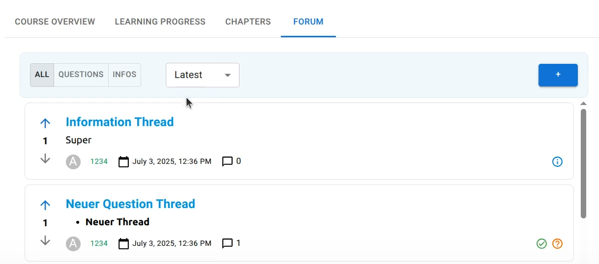
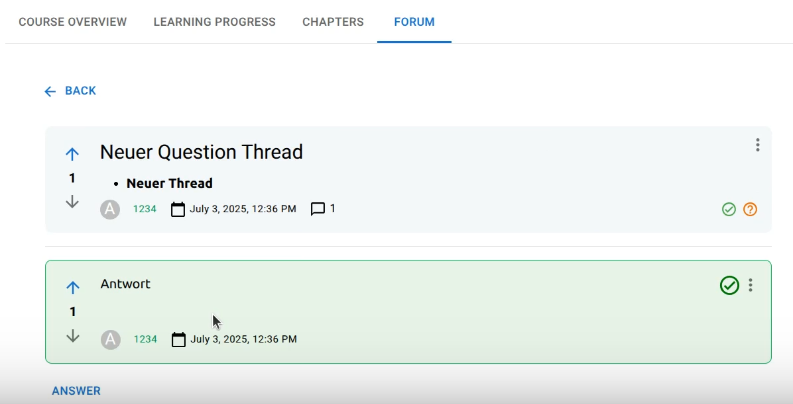
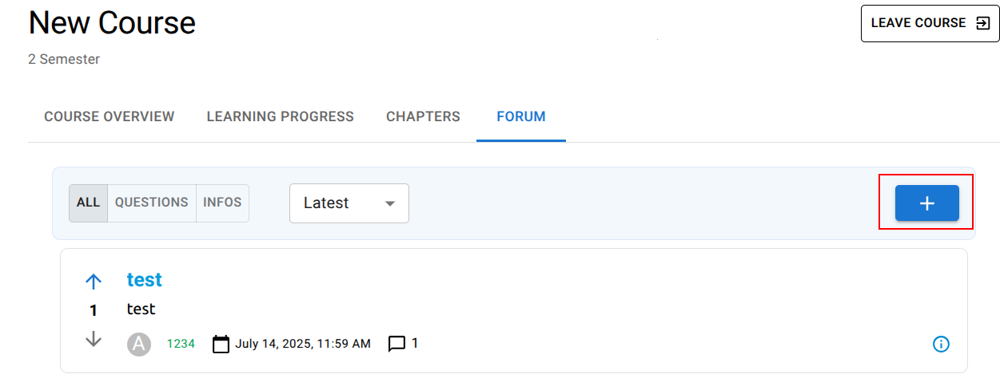
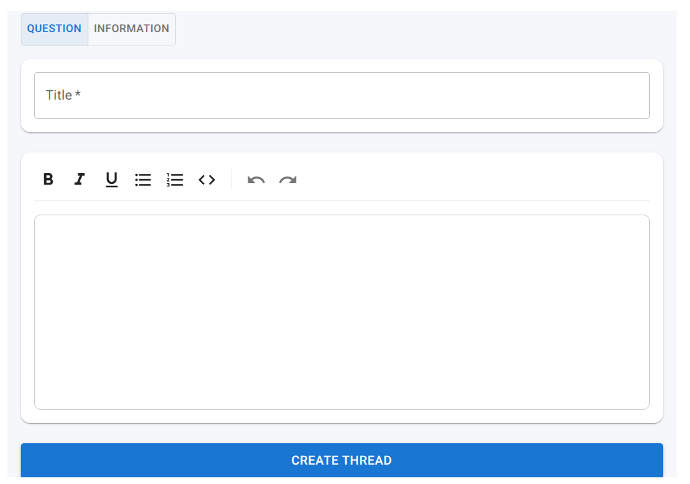
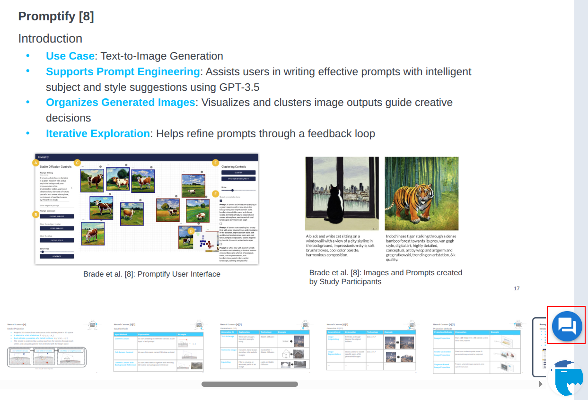
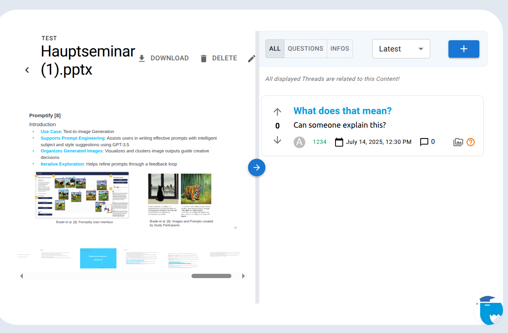

# Forum
## Introduction
- The application provides a forum for each course, enabling students and instructors to engage in course-specific discussions.
## Open Forum
-   To access a course's forum, select the course and navigate to the forum in the course header.

## Forum Overview
- After navigating to the forum, users are presented with an overview of all posted threads.
- Users can utilize various filtering options to easily find relevant threads.
- Threads are categorized into two types: Question Threads, where users can ask and answer questions, and Information Threads, which are used to share important updates
- Each thread, along with its answers, can be upvoted or downvoted by users to indicate helpfulness or relevance.

## Selecting a Thread
- Clicking on a thread opens a detailed view displaying all related answers and discussions.
- Users can contribute to the discussion by adding new answers to a thread. They also have the ability to edit or delete their own answers.
- The thread's author has the option to mark one answer as the "best answer" to highlight the most helpful contribution.

## Forum in the Media Content
- New Threads can be created using the '+' sign

- A new window will open where you can create a thread.
- Title and content are required fields.

## Forum in the Media Content
- The forum can also be accessed from the media content by clicking the forum icon.

- A resizable forum panel will appear next to the media content, displaying only posts related to that specific media.
- Creating a new thread from here will automatically link it to the media content — note that the thread will still be visible in the general forum overview.

