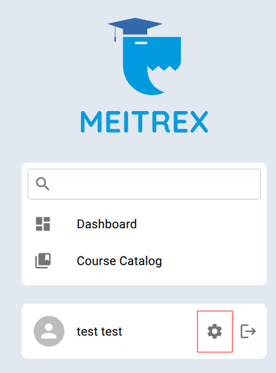
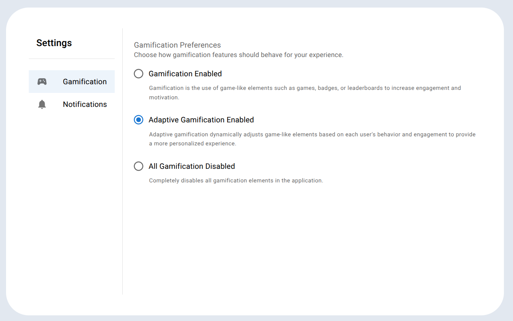
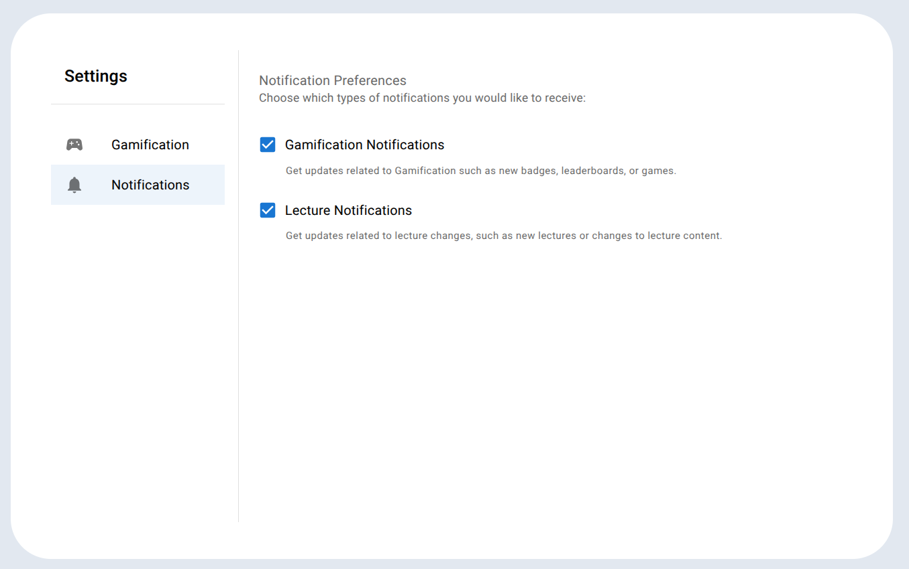

# Settings
The settings can be accessed via the gear icon located next to the logout button.

## Gamification 
- In this application, you can choose from three gamification options.
- By default, Adaptive Gamification is enabled.
- Please note that only one option can be active at a time.
- The available options are explained in the following screenshot.

## Notifications
- In this application, you can choose from two notification options.
- By default, Gamification Notifications and Lecture Notifications are enabled.
- The available options are explained in the following screenshot.

